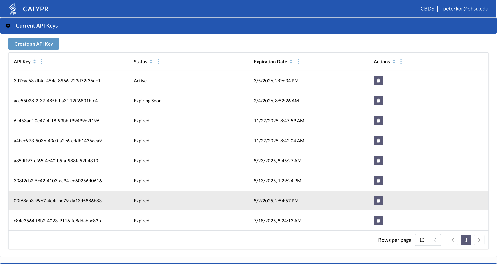
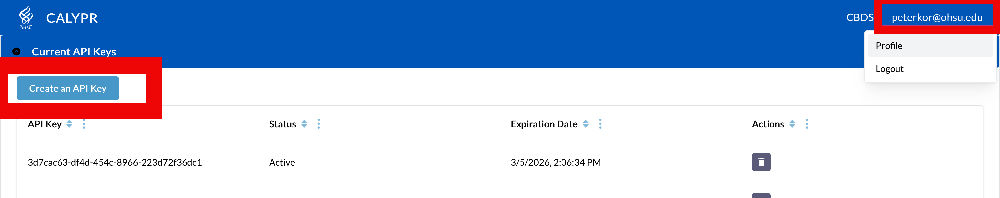
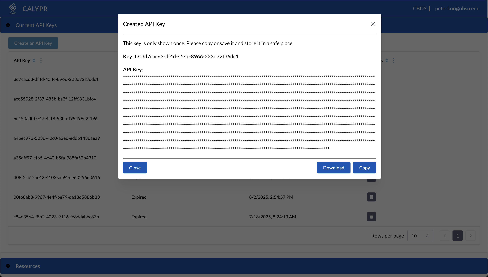

# CALYPR Quick Start Guide

Welcome to CALYPR! This guide will walk you through the essential workflow for managing and analyzing genomic data on the CALYPR platform.

## What is CALYPR?

CALYPR is a genomic data science platform that combines the best of cloud-based data commons with familiar version control tools. Think of it as "Git for genomic data" — you can version, track, and collaborate on massive datasets while maintaining full reproducibility.

**Key Benefits:**
- **Version Control**: Track genomic data files like you track code
- **Interoperability**: Built on GA4GH standards (DRS, TES) for seamless data sharing
- **Scalability**: From a few samples to petabyte-scale cohorts
- **Reproducibility**: Every analysis tied to specific versions of data and metadata

## What You'll Learn

This guide covers the essential CALYPR workflow:

1. **Getting access** to the CALYPR platform
2. **Uploading data files** with Git-DRS
3. **Adding metadata** with Forge
4. **Running analyses** with Funnel (optional)
5. **Querying data** with GRIP (optional)

## Prerequisites

Before you begin, make sure you have:

- **Git** installed on your system ([download](https://git-scm.com))
- **Access to CALYPR** - contact your project administrator for an account
- **Basic command-line experience** - familiarity with terminal/shell commands

---

## The CALYPR Workflow

### Step 1: Get Your API Credentials

To interact with CALYPR, you need API credentials from the Gen3 data commons.

1. **Log in** to the CALYPR portal at [https://calypr-public.ohsu.edu/](https://calypr-public.ohsu.edu/)

2. **Navigate to your Profile page** and click "Create API Key"

   

3. **Download the JSON credentials file**

   
   
   

4. **Save the file** in a secure location (recommended: `~/.gen3/credentials.json`)

!!! warning "Credential Expiration"
    API credentials expire after 30 days. You'll need to download fresh credentials regularly.

---

### Step 2: Upload Your Data Files (Git-DRS)

**Git-DRS** is CALYPR's data file management tool. It extends Git LFS to version and track large genomic files while automatically registering them with the DRS (Data Repository Service).

#### What Git-DRS Does

- Versions large data files (BAM, FASTQ, VCF, etc.) without bloating your Git repository
- Tracks file lineage and provenance
- Registers files with DRS for global discovery
- Enables data sharing with collaborators

#### Quick Setup

1. **Install Git-LFS** (required dependency):

   === "macOS"
       ```bash
       brew install git-lfs
       git lfs install --skip-smudge
       ```

   === "Linux"
       ```bash
       # Debian/Ubuntu
       sudo apt-get install git-lfs
       git lfs install --skip-smudge
       
       # RHEL/CentOS
       sudo yum install git-lfs
       git lfs install --skip-smudge
       ```

   === "Windows"
       Download from [git-lfs.com](https://git-lfs.com/) and run:
       ```bash
       git lfs install --skip-smudge
       ```

2. **Install Git-DRS**:

   ```bash
   /bin/bash -c "$(curl -fsSL https://raw.githubusercontent.com/calypr/git-drs/refs/heads/main/install.sh)"
   ```

3. **Set up your project**:

   ```bash
   # Create or clone your repository
   git clone https://github.com/your-org/your-project.git
   cd your-project
   
   # Initialize Git-DRS
   git drs init
   
   # Add your DRS remote (using the credentials from Step 1)
   git drs remote add gen3 production \
       --cred ~/.gen3/credentials.json \
       --url https://calypr-public.ohsu.edu \
       --project your-project-id \
       --bucket your-bucket-name
   ```

4. **Upload data files**:

   ```bash
   # Track file types with Git LFS
   git lfs track "*.bam"
   git lfs track "*.fastq.gz"
   
   # Add files
   git add .gitattributes
   git add data/sample1.bam
   
   # Commit and push (automatically registers with DRS)
   git commit -m "Add genomic data"
   git push
   ```

!!! tip "What Happens During Push"
    When you push, Git-DRS automatically:
    
    1. Uploads files to your S3 bucket
    2. Registers DRS records in Gen3
    3. Creates unique DRS IDs for global access
    4. Stores only pointer files in Git

**Learn More:** [Git-DRS Complete Documentation](../tools/git-drs/quickstart.md)

---

### Step 3: Add Metadata (Forge)

**Forge** is CALYPR's metadata management tool. It helps you validate and publish structured metadata about your samples, ensuring your data is discoverable and queryable.

#### What Forge Does

- Validates metadata against Gen3 data models
- Publishes metadata to make data searchable
- Manages relationships between samples, subjects, and files
- Ensures data quality and consistency

#### Quick Setup

1. **Install Forge**:

   ```bash
   pip install gen3forge
   ```

2. **Prepare your metadata**:

   Create a TSV or JSON file with your sample metadata following the Gen3 data model:

   ```json
   {
     "sample_id": "SAMPLE001",
     "subject_id": "SUBJECT001",
     "tissue_type": "blood",
     "collection_date": "2024-01-15"
   }
   ```

3. **Validate your metadata**:

   ```bash
   # Validate against the schema
   forge validate data metadata.json
   ```

4. **Publish to Gen3**:

   ```bash
   # Publish validated metadata
   forge publish
   ```

!!! note "Metadata Before Files"
    While you can upload files first, metadata makes your data discoverable. Consider validating metadata early in your workflow.

**Learn More:** [Forge Documentation](../tools/forge/index.md)

---

### Step 4: Run Analysis Workflows (Funnel) — Optional

**Funnel** is CALYPR's task execution service. It runs computational workflows across cloud and HPC environments using the GA4GH Task Execution Service (TES) standard.

#### What Funnel Does

- Executes containerized workflows (Docker/Singularity)
- Manages resources across AWS, GCP, and HPC clusters
- Tracks task status and logs
- Integrates with workflow engines (Nextflow, WDL)

#### Quick Start

1. **Define a task** (JSON format):

   ```json
   {
     "name": "Variant Calling",
     "executors": [{
       "image": "broadinstitute/gatk",
       "command": ["gatk", "HaplotypeCaller", "-I", "sample.bam"]
     }]
   }
   ```

2. **Submit the task**:

   ```bash
   funnel task create task.json
   ```

3. **Check status**:

   ```bash
   funnel task get <task-id>
   ```

!!! info "Advanced Use"
    Funnel is typically used for production pipelines and large-scale analysis. For exploratory work, you might run analyses locally first.

**Learn More:** [Funnel Documentation](../tools/funnel/index.md)

---

### Step 5: Query Your Data (GRIP) — Optional

**GRIP** (Graph Resource Integration Platform) enables powerful graph-based queries across integrated datasets.

#### What GRIP Does

- Queries relationships between samples, subjects, and files
- Performs complex graph traversals
- Aggregates data across multiple projects
- Enables federated queries across data commons

#### Quick Example

```bash
# Query all samples from a specific subject
grip query my-project 'V().hasLabel("Subject").has("id", "SUBJ001").out("samples")'

# Find all BAM files for a tissue type
grip query my-project 'V().hasLabel("Sample").has("tissue", "blood").out("files").hasLabel("BAM")'
```

!!! info "Advanced Querying"
    GRIP is most useful after you've integrated metadata and established relationships between entities.

**Learn More:** [GRIP Documentation](../tools/grip/index.md)

---

## Next Steps

Now that you understand the basic CALYPR workflow, here are some recommended next steps:

### 📚 Dive Deeper

- **[Data Management](data-management/git-drs.md)** - Advanced Git-DRS workflows
- **[Metadata Guide](data-management/metadata.md)** - Data modeling and metadata best practices
- **[Project Management](project-management/create-project.md)** - Creating and managing CALYPR projects

### 🔧 Tool Documentation

- **[Git-DRS Complete Guide](../tools/git-drs/quickstart.md)** - Comprehensive Git-DRS documentation
- **[Forge Reference](../tools/forge/index.md)** - Metadata validation and publishing
- **[Funnel Workflows](../tools/funnel/index.md)** - Task execution and pipeline management
- **[GRIP Queries](../tools/grip/index.md)** - Graph-based data queries

### 🆘 Get Help

- **[Troubleshooting](troubleshooting.md)** - Common issues and solutions
- **[Platform Overview](index.md)** - Learn more about CALYPR architecture

### 💬 Community

CALYPR is in active development. Have questions or feedback? Reach out to the CALYPR team or your project administrator.

---

## Summary

You've learned the essential CALYPR workflow:

✅ **Access** - Get Gen3 API credentials  
✅ **Upload** - Use Git-DRS to version and track data files  
✅ **Annotate** - Use Forge to add and validate metadata  
✅ **Analyze** - Use Funnel to run computational workflows (optional)  
✅ **Query** - Use GRIP to explore data relationships (optional)

Each tool builds on the previous step, creating a complete data lifecycle from upload to analysis. Start with the basics (access, upload, annotate) and add advanced features as your needs grow.

Happy analyzing! 🧬
