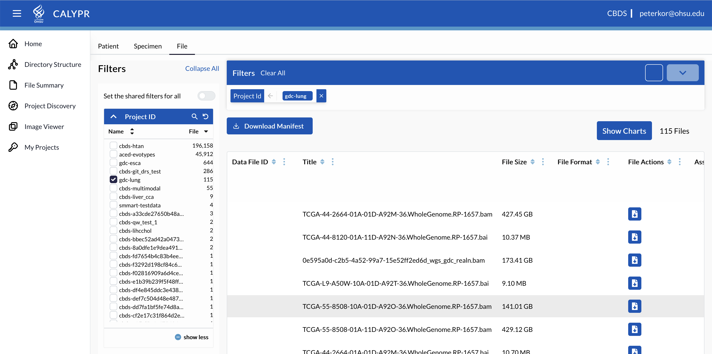

# Explore

The `push` command uploads the metadata associated with the project and makes the files visible on the [Explorer page](https://calypr.ohsu.edu/Explorer).

See the [portal download page](portal-download.md) for more information on downloading files from the portal.
