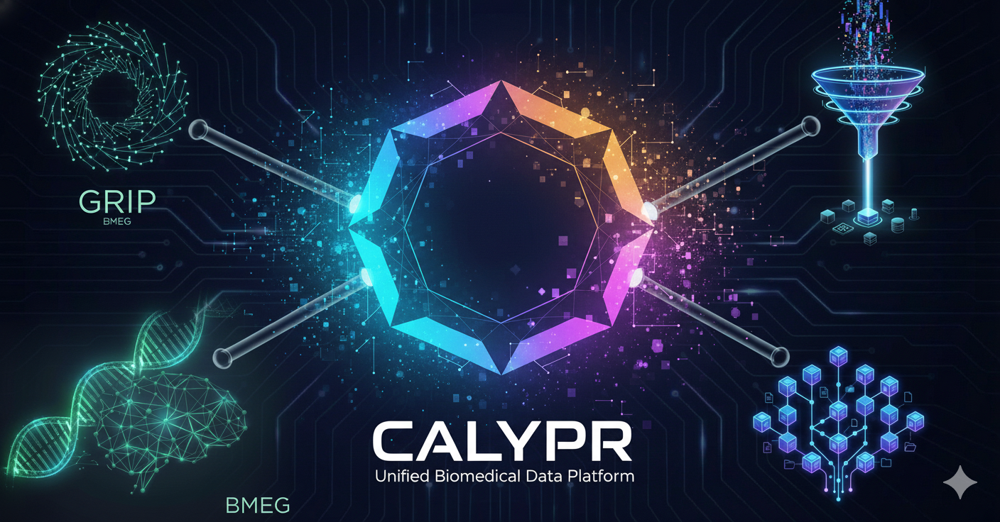

<!-- Hides the title -->

  <h1 style="font-size: 2.5rem; font-weight: 700; margin-bottom: 1rem;">CALYPR Platform</h1>
  

    A scalable, hybrid cloud infrastructure designed for the demands of modern genomics research. 
    Built on open-source standards, CALYPR provides GA4GH-compliant tools for seamless data integration, analysis, and biological insights. Based on the <a style="color: var(--md-primary-fg-color);" href="https://gen3.org">Gen3</a> Data Commons architecture, CALYPR empowers analysts to manage large-scale genomic datasets and integrate data to build new predictive models.
  

  

    <a href="/calypr/quick-start/" class="md-button md-button--primary" style="font-size: 1.1rem; padding: 0.8rem 2rem; border-radius: 8px;">🚀 Get Started Quickly</a>
  

  
Built on Open Standards

  

    

      
TES

      
Task Execution Service. A GA4GH standard for distributed task execution to enable federated computing.

    

    

      
DRS

      
Data Reference System. A GA4GH standard for data discovery and access.

    

    

      
FHIR

      
Healthcare Interoperability. Exchanging patient health information.

    

    

      
JSON Hyper-Schema

      
JSON-Schema + Graph data. Represent complex and high quality data.

    

  

  

  <!-- CALYPR -->
  

    

      
    

    

      
Scalable genomics data science platform for biological insights.

      
Next-generation genomics data science platform with scalable cloud / on-prem hybrid infrastructure, streamlining the journey from raw data to discovery.

      <a href="calypr/" class="product-card__link">Learn more <i>→</i></a>
    

  

  <!-- GRIP -->
  

    

      
    

    

      <h2 class="product-card__title">GRIP</h2>
      
Graph-based data integration for complex research datasets.

      
High-performance graph query engine that provides a unified interface across MongoDB, SQL, and key-value stores. Ideal for complex relational discovery in genomics.

      <a href="tools/grip/" class="product-card__link">Learn more <i>→</i></a>
    

  

  <!-- Funnel -->
  

    

      
    

    

      <h2 class="product-card__title">Funnel</h2>
      
Distributed task execution for petabyte-scale pipelines.

      
Standardized batch computing using the GA4GH TES API. Run Docker-based tasks seamlessly across AWS, Google Cloud, and Kubernetes at any scale.

      <a href="tools/funnel/" class="product-card__link">Learn more <i>→</i></a>
    

  

  <!-- Git-DRS -->
  

    

      
    

    

      <h2 class="product-card__title">Git-DRS</h2>
      
Secure data repository system with version control.

      
Manage large-scale genomic data with integrated versioning and metadata management, ensuring reproducibility and data integrity throughout research cycles.

      <a href="tools/git-drs/" class="product-card__link">Learn more <i>→</i></a>
    

  

  <h2 style="font-size: 1.5rem; font-weight: 600; margin-bottom: 1rem;">Join the Beta</h2>
  

    CALYPR is currently in <strong>private beta</strong>. If you are interested in early access or a demonstration of the platform, please reach out to us at 
    <a style="color: var(--md-primary-fg-color);" href="mailto:sales@calypr.com">sales@calypr.com</a>. In the meantime, you can explore our <a style="color: var(--md-primary-fg-color);" href="https://github.com/calypr">GitHub repository</a> and get access to all of our open source tools.
  

