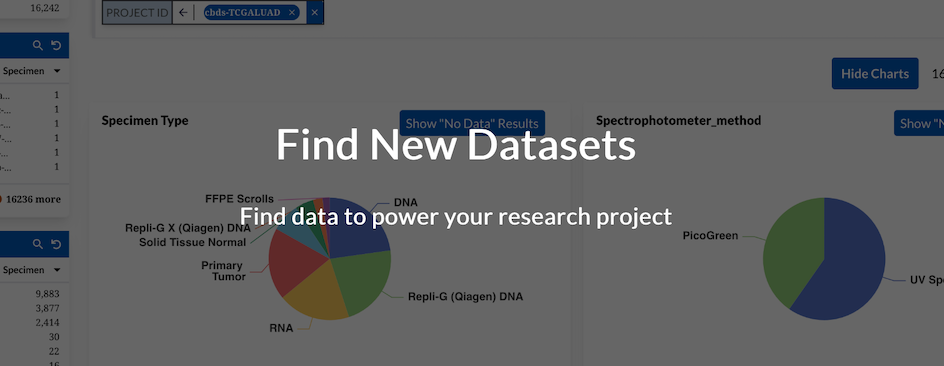
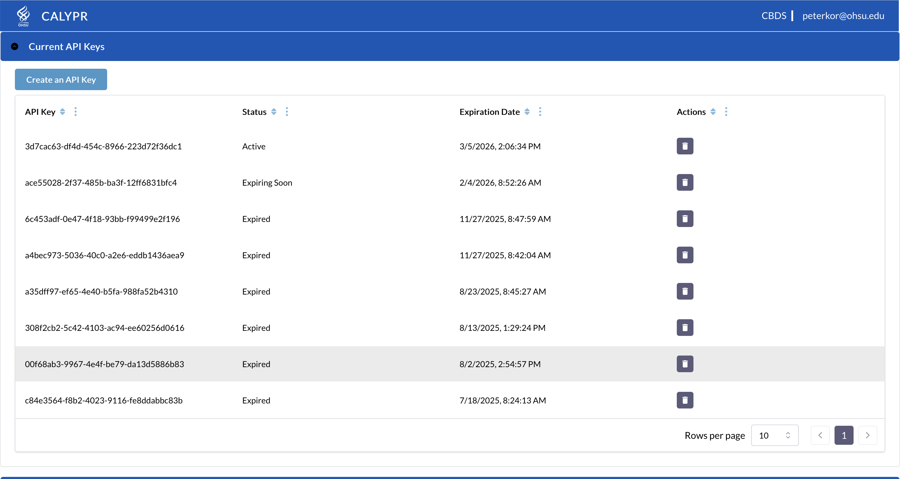

<section class="business-hero" aria-label="CALYPR homepage hero">
  

    
For translational researchers

    <h1>Explore data, manage projects, and run reproducible workflows in one platform.</h1>
    

      CALYPR helps translational teams move from study intake to analysis output with governed data access, project-level controls, and execution history you can audit.
    

    

      <a href="products/" class="md-button md-button--primary">Explore products</a>
      <a href="developers/" class="md-button">See technical docs</a>
      <a href="solutions/" class="md-button">Match a use case</a>
    

  

  

    
  

</section>

<section class="solution-section" aria-label="Product workflow examples">
  
Task walkthroughs

  <h2>Common research tasks, demonstrated with synthetic projects.</h2>
  

    <article class="usecase-panel">
      <h3>1) Explore and organize research data</h3>
      
TRX-101 Lung Response Cohort

      
Browse study files and metadata, then filter assets by cohort and assay type before analysis kickoff.

      
    </article>
    <article class="usecase-panel">
      <h3>2) Manage project collaborators and access</h3>
      
TRX-204 AML Multi-site Registry

      
Review project member context and enforce role-based access before exposing new datasets to partner labs.

      
    </article>
    <article class="usecase-panel">
      <h3>3) Integrate new data drops</h3>
      
TRX-318 Immunotherapy Biomarker Study

      
Upload files from collaborating sites and register each drop with provenance and project metadata.

      
    </article>
    <article class="usecase-panel">
      <h3>4) Execute workflows and retrieve outputs</h3>
      
TRX-101 Lung Response Cohort

      
Run a reproducible workflow, monitor status, and download artifacts for reporting and downstream modeling.

      
    </article>
  

</section>

<section class="solution-section" aria-label="Synthetic project catalog">
  
Project catalog

  <h2>These synthetic projects back the workflows above.</h2>
  

    <article class="usecase-panel">
      <h3>TRX-101 Lung Response Cohort</h3>
      
Tracks longitudinal response across NSCLC participants with linked pathology files, omics outputs, and analysis runs.

      

        <a href="products/manage-data/">Data exploration workflow</a>
        <a href="products/manage-compute/">Workflow execution workflow</a>
      

    </article>
    <article class="usecase-panel">
      <h3>TRX-204 AML Multi-site Registry</h3>
      
Demonstrates project governance with institution-specific access, collaborator onboarding, and cross-site portfolio tracking.

      

        <a href="products/manage-data/">Project management workflow</a>
        <a href="developers/">Technical implementation details</a>
      

    </article>
    <article class="usecase-panel">
      <h3>TRX-318 Immunotherapy Biomarker Study</h3>
      
Shows governed file intake and metadata integration from collaborating wet-lab and clinical data partners.

      

        <a href="products/integrate-data/">Data integration workflow</a>
        <a href="products/manage-data/">Governed data operations</a>
      

    </article>
  

</section>

<section class="home-footer" aria-label="Time-to-Decision Toolkit">
  

    
What you need before deciding

    <h2>Complete a lightweight self-assessment in 20 minutes.</h2>
    

      

        <h3>Governance readiness check</h3>
        
Clarifies your policy gaps and ensures CALYPR can support your compliance requirements without slowing researcher workflows.

      

      

        <h3>Workflow portability audit</h3>
        
Tests your code environment and identifies how easily your existing scripts and workflows can execute on CALYPR infrastructure.

      

      

        <h3>Data asset inventory template</h3>
        
Maps what you already manage and surfaces the immediate operational lift before your teams engage with implementation planning.

      

    

    

      <a href="#" class="md-button md-button--primary">Explore Tools</a>
      <a href="#" class="md-button">Examine sample datasets</a>
    

  

</section>
