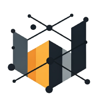
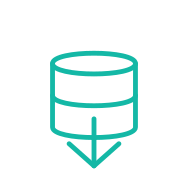
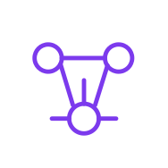

<section class="business-hero">
  

    
Research data infrastructure

    <h1>Govern biomedical data without slowing down research.</h1>
    

      CALYPR helps research organizations control data access, run reproducible analysis, connect metadata, and prepare model-ready assets across cloud, on-prem, and federated environments.
    

    

      <a href="products/" class="md-button md-button--primary">Products</a>
      <a href="solutions/" class="md-button">Solutions</a>
    

  

  

    
  

</section>

<section class="product-banners" aria-label="CALYPR product areas">
  <article class="product-banner product-banner--data">
    

      
Data product

      <h2>Manage Data</h2>
      
Give research teams governed access to large datasets, durable data references, and controlled data movement.

      

        

          
Audience

          

            <a href="personas/data-steward/">Data Steward</a>
            <a href="personas/platform-engineer/">Platform Engineer</a>
            <a href="personas/security-compliance-reviewer/">Security Compliance Reviewer</a>
          

        

        

          
Tools

          

            <a href="tools/git-drs/">Git-DRS</a>
            <a href="tools/syfon/">Syfon</a>
            <a href="tools/data-client/">Data Client</a>
          

        

      

    

    
  </article>

  <article class="product-banner product-banner--compute">
    

      
Compute product

      <h2>Manage Compute</h2>
      
Run reproducible workflows across cloud, cluster, and local environments without rebuilding how teams work.

      

        

          
Audience

          

            <a href="personas/platform-engineer/">Platform Engineer</a>
            <a href="personas/workflow-engineer/">Workflow Engineer</a>
          

        

        

          
Tools

          

            <a href="tools/funnel/">Funnel</a>
            <a href="tools/git-drs/">Git-DRS</a>
          

        

      

    

    
  </article>

  <article class="product-banner product-banner--integrate">
    

      
Integration product

      <h2>Integrate Data</h2>
      
Turn fragmented clinical, omics, and project metadata into structured context teams can search and reuse.

      

        

          
Audience

          

            <a href="personas/data-steward/">Data Steward</a>
            <a href="personas/platform-engineer/">Platform Engineer</a>
            <a href="personas/standards-architecture-lead/">Standards Architecture Lead</a>
          

        

        

          
Tools

          

            <a href="tools/forge/">Forge</a>
            <a href="tools/grip/">GRIP</a>
            <a href="tools/sifter/">Sifter</a>
          

        

      

    

    
  </article>

  <article class="product-banner product-banner--models">
    

      
Model product

      <h2>Manage Models</h2>
      
Carry governed data, workflow provenance, and benchmark context into model-driven research operations.

      

        

          
Audience

          

            <a href="personas/workflow-engineer/">Workflow Engineer</a>
            <a href="personas/researcher-bioinformatician/">Researcher Bioinformatician</a>
            <a href="personas/standards-architecture-lead/">Standards Architecture Lead</a>
          

        

        

          
Tools

          

            <a href="tools/grip/">GRIP</a>
            <a href="tools/funnel/">Funnel</a>
            <a href="tools/forge/">Forge</a>
          

        

      

    

    
  </article>
</section>

<section class="home-footer" aria-label="One platform story">
  

    
One platform story

    <h2>A platform story built for research programs, not just platform engineers.</h2>
    

      

        <h3>Start with the program problem</h3>
        
Use the Solutions section to see how CALYPR supports governed data access, reproducible analysis, metadata operations, and model-ready research assets.

      

      

        <h3>Adopt by product area</h3>
        
The Products section turns those needs into four clear offers: Manage Data, Manage Compute, Integrate Data, and Manage Models.

      

      

        <h3>Keep technical depth available</h3>
        
Technical teams can still reach the full CALYPR and tool documentation, but that detail stays in Developers instead of overwhelming non-technical readers.

      

    

    

      <a href="products/" class="md-button md-button--primary">Products</a>
      <a href="solutions/" class="md-button">Solutions</a>
    

  

</section>
