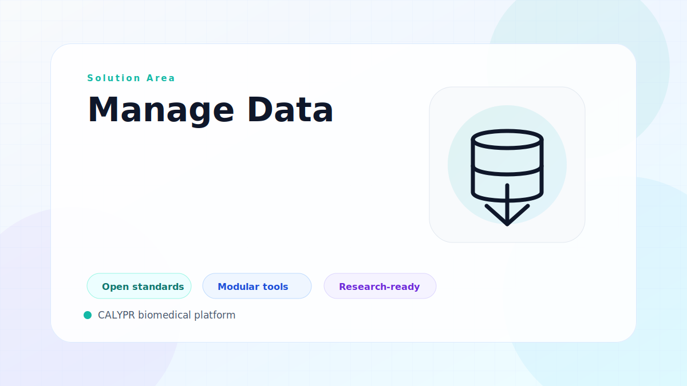
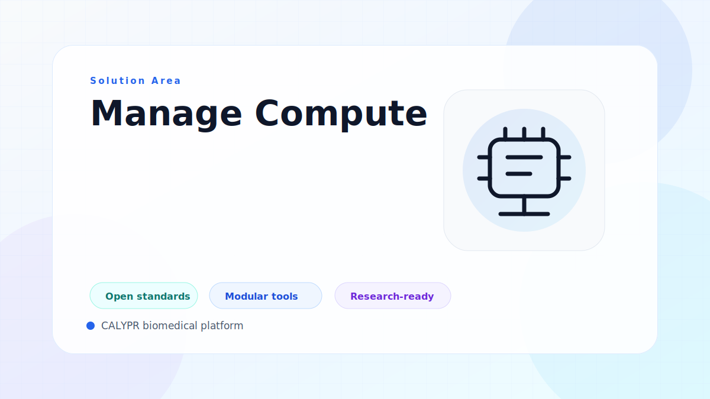
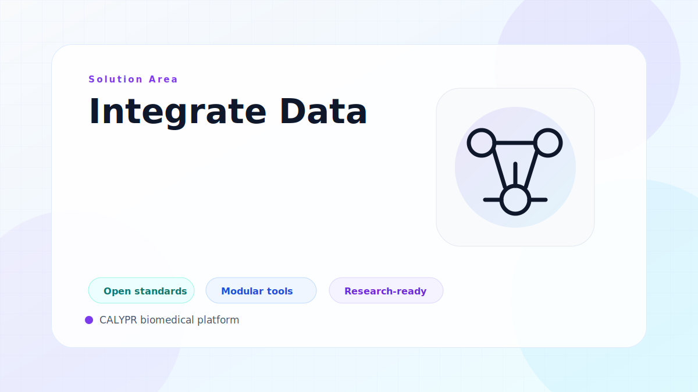
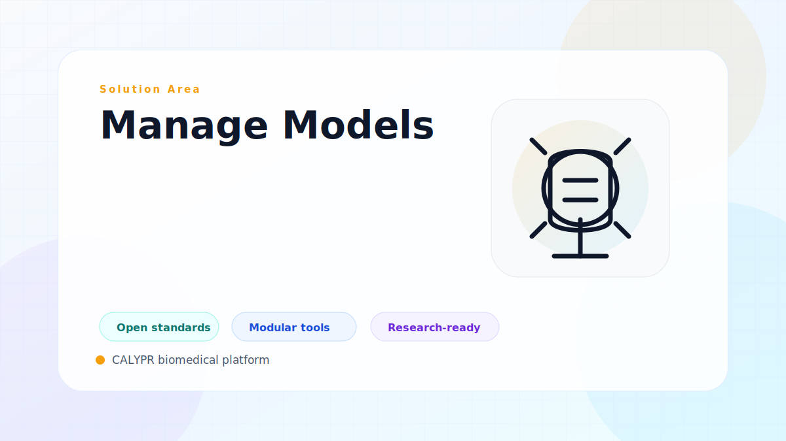

<section class="business-hero">
  

    
Research data infrastructure

    <h1>Govern biomedical data without slowing down research.</h1>
    

      CALYPR helps research organizations control data access, run reproducible analysis, connect metadata, and prepare model-ready assets across cloud, on-prem, and federated environments.
    

    

      <a href="products/" class="md-button md-button--primary">See products</a>
      <a href="solutions/" class="md-button">See solutions</a>
    

  

  

    
  

</section>

<section class="product-banners" aria-label="CALYPR product areas">
  <article class="product-banner product-banner--data">
    

      
Data product

      <h2>Manage Data</h2>
      
Give research teams governed access to large datasets, durable data references, and controlled data movement.

      

        <a href="products/manage-data/">Product overview</a>
        <a href="solutions/">Business use cases</a>
      

    

    
  </article>

  <article class="product-banner product-banner--compute">
    

      
Compute product

      <h2>Manage Compute</h2>
      
Run reproducible workflows across cloud, cluster, and local environments without rebuilding how teams work.

      

        <a href="products/manage-compute/">Product overview</a>
        <a href="solutions/">Business use cases</a>
      

    

    
  </article>

  <article class="product-banner product-banner--integrate">
    

      
Integration product

      <h2>Integrate Data</h2>
      
Turn fragmented clinical, omics, and project metadata into structured context teams can search and reuse.

      

        <a href="products/integrate-data/">Product overview</a>
        <a href="solutions/">Business use cases</a>
      

    

    
  </article>

  <article class="product-banner product-banner--models">
    

      
Model product

      <h2>Manage Models</h2>
      
Carry governed data, workflow provenance, and benchmark context into model-driven research operations.

      

        <a href="products/manage-models/">Product overview</a>
        <a href="solutions/">Business use cases</a>
      

    

    
  </article>
</section>

<section class="business-section business-section--muted">
  
One platform story

  <h2>A platform story built for research programs, not just platform engineers.</h2>
  

    <article>
      <h3>Start with the program problem</h3>
      
Use the Solutions section to see how CALYPR supports governed data access, reproducible analysis, metadata operations, and model-ready research assets.

    </article>
    <article>
      <h3>Adopt by product area</h3>
      
The Products section turns those needs into four clear offers: Manage Data, Manage Compute, Integrate Data, and Manage Models.

    </article>
    <article>
      <h3>Keep technical depth available</h3>
      
Technical teams can still reach the full CALYPR and tool documentation, but that detail stays in Developers instead of overwhelming non-technical readers.

    </article>
  

  

    <a href="products/" class="md-button md-button--primary">Browse products</a>
    <a href="solutions/" class="md-button">Browse solutions</a>
  

</section>
