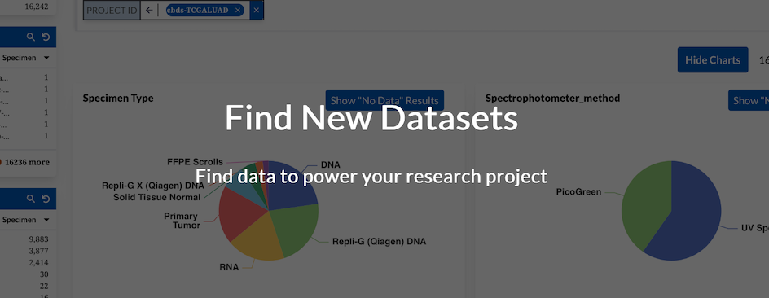

# Welcome to the CALYPR Documentation

This documentation will walk you through the steps for submitting data to the [CALYPR Data Commons](https://calypr.ohsu.edu.org).

## About
The [gen3-tracker](https://github.com/CALYPR/gen3_util/) (g3t) command line utility is a combination of tools that facilitate data sharing on the CALYPR platform. It allows you to create a unified data project, upload files, and associate those files with metadata in an incremental manner. Submitted data with g3t gives you all the benefits the data platform offers: data indexing, data exploration, consolidated access, and more!

The following guide details the steps a data contributor must take to submit a project to the CALYPR data commons.

## Getting Started

To navigate through each page, use pages list in the top left or using the navigation arrow on the bottom left and right! Otherwise, check out our [requirements](requirements.md) page to get started.

