# Researcher / Bioinformatician

This persona turns governed datasets and metadata into analysis outcomes, comparative studies, and model-ready assets.

## Typical Priorities

- Discover and reuse datasets with enough context to trust them.
- Run reproducible workflows without rebuilding platform plumbing.
- Carry data, metadata, and provenance forward into model evaluation.

## Related Solutions

- [Integrate Data](../solutions/integrate-data.md)
- [Manage Compute](../solutions/manage-compute.md)
- [Manage Models](../solutions/manage-models.md)

