# Security / Compliance Reviewer

Security and compliance reviewers assess policy controls, access boundaries, and operational evidence for sensitive research programs.

## Typical Priorities

- Verify role boundaries and controlled access behavior.
- Ensure operational workflows are auditable and policy aligned.
- Confirm data movement and compute execution follow governance requirements.

## Related Solutions

- [Manage Data](../solutions/manage-data.md)
- [Manage Compute](../solutions/manage-compute.md)

