# Standards / Architecture Lead

Standards and architecture leads align implementation choices with long-term portability, interoperability, and organizational operating constraints.

## Typical Priorities

- Keep interfaces grounded in open standards and clear contracts.
- Ensure data, metadata, and workflow capabilities compose as one system.
- Balance near-term delivery with durable platform architecture.

## Related Solutions

- [Integrate Data](../solutions/integrate-data.md)
- [Manage Data](../solutions/manage-data.md)
- [Manage Compute](../solutions/manage-compute.md)
- [Manage Models](../solutions/manage-models.md)

