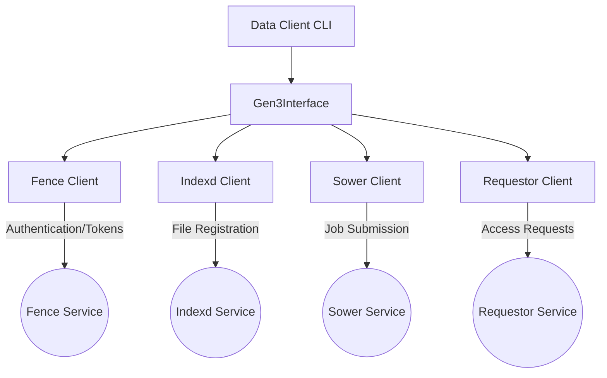

# Data Client

The `data-client` is the modern CALYPR client library and CLI tool. It serves two primary purposes:
1.  **Data Interaction**: A unified interface for uploading, downloading, and managing data in Gen3 Data Commons.
2.  **Permissions Management**: It handles user access and project collaboration, replacing older tools like `calypr_admin`.

## Architecture

The `data-client` is built upon a modular architecture centered around the `Gen3Interface`. This interface acts as a facade, coordinating interactions with specific Gen3 services.



### Components

The `data-client` integrates the following Gen3 clients:

- **Fence Client**: Handles authentication (API keys, Access Tokens) and presigned URL generation for data access.
- **Indexd Client**: Manages file registration (GUIDs), indexing, and file location resolution.
- **Sower Client**: Manages job submissions and monitoring (e.g., for data analysis workflows).
- **Requestor Client**: Handles data access requests and collaboration management.

## Configuration

The `data-client` uses a configuration profile system to manage credentials for different Gen3 commons.

Configuration is stored in `~/.gen3/gen3_client_config.ini`.

### Setting up a Profile

To configure a new profile, you need an API Key (Credential file) downloaded from the Gen3 Commons profile page.

```bash
./data-client configure --profile=<profile-name> --cred=<path-to-cred.json> --apiendpoint=<commons-url>
```

Example:
```bash
./data-client configure --profile=mycommons --cred=credentials.json --apiendpoint=https://data.mycommons.org
```

Once configured, you can use the `--profile` flag in other commands to target this environment.
