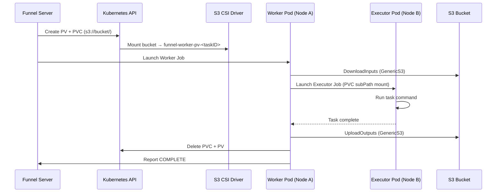

!!! warning
    Funnel on Kubernetes is in active development and may involve frequent updates 🚧

# Kubernetes

## 1. Add Helm Repo

!!! note
    See Funnel's [Helm Charts](https://github.com/calypr/helm-charts/tree/main/charts/funnel) for the latest configuration options

```sh
helm repo add calypr https://calypr.org/helm-charts

helm repo update calypr

helm search repo calypr/funnel
```

## 2. Deploy Funnel

```sh
helm upgrade --install funnel calypr/funnel

kubectl rollout status deployment/funnel-server

kubectl get deployments
# NAME           READY   STATUS
# funnel-server   1/1     Running
```

## 4. Port-Forward for Local Access

```sh
kubectl port-forward svc/funnel 8000:8000

funnel task list
# {}
```

## 4. Submit Example Task

```sh
funnel examples hello-world > hello-world.json

funnel task create hello-world.json
# <Task ID>

funnel task get <Task ID> --view MINIMAL
# { "id": "...", "state": "COMPLETE" }
```

# Storage Architecture

Funnel uses the [AWS S3 CSI Driver](https://github.com/awslabs/mountpoint-s3-csi-driver) to provision a per-task PersistentVolume (PV) and PersistentVolumeClaim (PVC) backed by S3. This gives Worker and Executor pods `ReadWriteMany` access across nodes without requiring them to co-schedule.



# Additional Resources 📚

- [Helm Repo](https://calypr.org/helm-charts)
- [Helm Repo Source](https://github.com/ohsu-comp-bio/helm-charts)
- [Helm Chart values reference](https://github.com/ohsu-comp-bio/helm-charts/tree/main/charts/funnel)
- [AWS S3 CSI Driver](https://github.com/awslabs/mountpoint-s3-csi-driver)
- [The Chart Best Practices Guide](https://helm.sh/docs/chart_best_practices/)
- [GitHub issue #1412 — S3 Working Directory Behavior](https://github.com/calypr/funnel/issues/1412)
