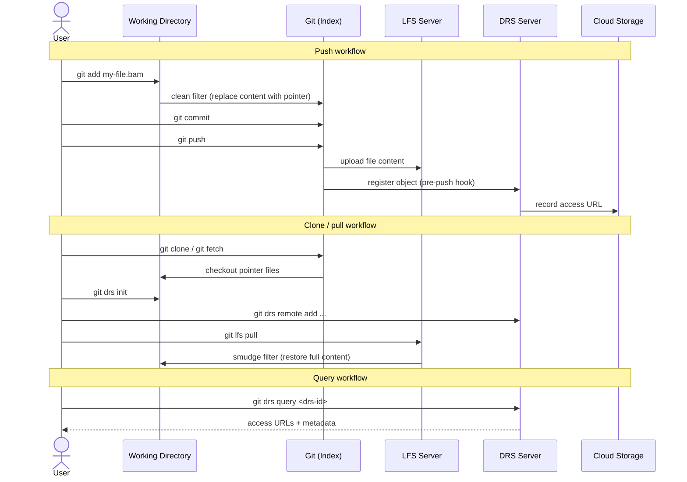

# Git DRS — How It Works

This document describes the internal architecture, pointer file format, and supported cloud backends for Git DRS. For the user-facing command reference and getting started guide, see the [Git DRS Quickstart](quickstart.md).

## How It Works

Git DRS leverages the same **clean / smudge filter** mechanism and **custom transfer agent** protocol used by [Git LFS](https://git-lfs.com/). If you're familiar with [how Git LFS works under the hood](https://github.com/git-lfs/git-lfs/blob/main/docs/spec.md), the following diagram shows where Git DRS fits in:



**The workflow step by step:**

1. **`git lfs track "*.bam"`** — Registers file patterns in `.gitattributes`. See [Git LFS track](https://github.com/git-lfs/git-lfs/blob/main/docs/man/git-lfs-track.adoc).
2. **`git add` / `git commit`** — Standard Git operations. The clean filter replaces file content with a small pointer file.
3. **`git push`** — Git LFS uploads objects to the LFS server. Git DRS hooks automatically register each object with the configured DRS server, making it discoverable by DRS ID.
4. **`git clone` / `git lfs pull`** — Git LFS downloads objects on demand. The smudge filter restores pointer files to their full content. See [Git LFS pull](https://github.com/git-lfs/git-lfs/blob/main/docs/man/git-lfs-pull.adoc).
5. **`git drs query <drs-id>`** — Look up any registered object by its DRS ID to retrieve access URLs and metadata.

### Hooks Integration Table

| Hook/Integration | Command | Purpose |
|------------------|---------|---------|
| **Pre-commit Hook** | `git drs precommit` | Triggered automatically before each commit<br>Processes all staged LFS files<br>Creates DRS records for new files<br>Only processes files that don't already exist on the DRS server<br>Prepares metadata for later upload during push |
| **Custom Transfer (upload)** | `git drs transfer` | Handles upload operations during `git push`<br>Creates indexd record on DRS server<br>Uploads file to Gen3-registered S3 bucket<br>Updates DRS object with access URLs |
| **Custom Transfer (download)** | `git drs transfer` | Handles download operations during `git lfs pull`<br>Retrieves file metadata from DRS server<br>Downloads file from configured storage<br>Validates checksums |


### Protocol Communication

Git LFS and Git DRS communicate via JSON messages. Git LFS uses custom transfers to communicate with Git DRS, passing information through JSON protocol:

```json
{
  "event": "init",
  "operation": "upload",
  "remote": "origin",
  "concurrent": 3,
  "concurrenttransfers": 3
}
```

Response handling and logging occurs in transfer clients to avoid interfering with Git LFS stdout expectations.

For more details, see the [Git LFS Custom Transfer Protocol](https://github.com/git-lfs/git-lfs/blob/main/docs/custom-transfers.md) documentation.

## Configuration System

Git DRS stores configuration in Git's local config (`.git/config`).

**Example Configuration:**

```bash
$ git config --list  | grep drs
lfs.standalonetransferagent=drs
lfs.customtransfer.drs.args=transfer
lfs.customtransfer.drs.concurrent=true
lfs.customtransfer.drs.path=git-drs
lfs.customtransfer.drs.default-remote=calypr-public
lfs.customtransfer.drs.remote.calypr-dev.type=gen3
lfs.customtransfer.drs.remote.calypr-dev.endpoint=https://calypr-public.ohsu.edu
lfs.customtransfer.drs.remote.calypr-dev.project=program-project
lfs.customtransfer.drs.remote.calypr-dev.bucket=my-bucket

```

## Further Reading

- [Git DRS Quick Start](quickstart.md) -- User guide for getting started
- [Troubleshooting](troubleshooting.md) -- Common issues and solutions
- [Git LFS Custom Transfer Agents](https://github.com/git-lfs/git-lfs/blob/main/docs/custom-transfers.md) -- Understanding the transfer protocol
- [Git LFS Specification](https://github.com/git-lfs/git-lfs/blob/main/docs/spec.md) -- Pointer file format details
- [Git Hooks Documentation](https://git-scm.com/book/en/v2/Customizing-Git-Git-Hooks) -- Understanding Git hooks
