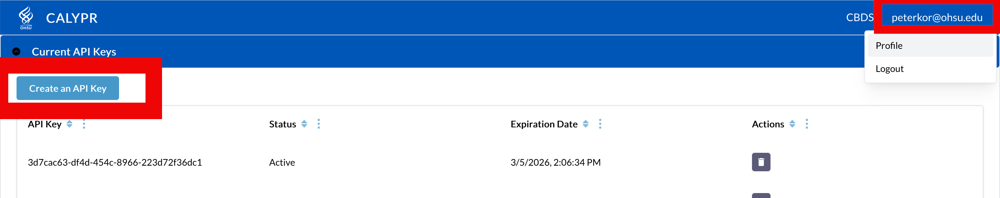
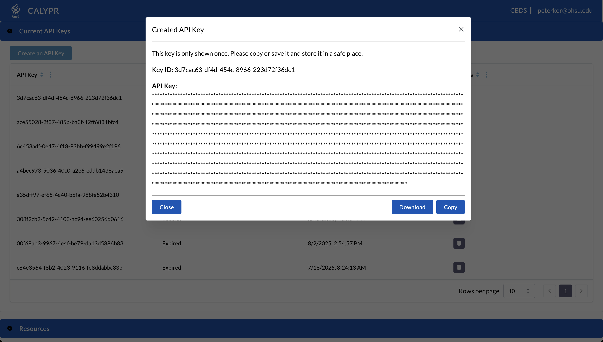

# Git DRS — Quick Start

This page is a deeper walkthrough of the current `git-drs` workflow.

!!! note "Git LFS is optional"
    `git-drs` does not require Git LFS for normal setup, tracking, push, or pull workflows.

    Git LFS compatibility is still supported for older repos and mixed environments. See [Git LFS Compatibility](git-lfs.md) if you need that mode.

## Prerequisites

Before installing Git DRS, you need **Git** installed on your system.

### Install Git

Visit [https://git-scm.com](https://git-scm.com) to download and install Git for your operating system.

## Install Git DRS

Use the project installer or release workflow described in the main [Quick Start](../quickstart.md) and [Installation Guide](../installation.md).

One installer path is:

```bash
/bin/bash -c "$(curl -fsSL https://raw.githubusercontent.com/calypr/git-drs/development/install.sh)" -- $GIT_DRS_VERSION
```

### Update PATH

Ensure git-drs is on your path:

```bash
echo 'export PATH="$PATH:$HOME/.local/bin"' >> ~/.bash_profile
source ~/.bash_profile
```

## Download Gen3 API Credentials

To use Git DRS, you need to configure it with API credentials downloaded from the [Profile page](https://calypr-public.ohsu.edu/Profile).

1. Log into the Gen3 data commons at [https://calypr-public.ohsu.edu/](https://calypr-public.ohsu.edu/)
2. Navigate to your Profile page
3. Click "Create API Key"



4. Download the JSON credentials file



5. Save it in a secure location (e.g., `~/.gen3/credentials.json`)

!!! warning "Credential Expiration"
    API credentials expire after 30 days. You'll need to download new credentials and refresh your Git DRS configuration regularly.


## Repository setup

[Clone an Existing Repository](#clone-an-existing-repository) or [Create a New Repository](#create-a-new-repository)

## Create a new repository:
```bash
mkdir your-data-repo
cd your-data-repo
git init
```

### 2. Add Remote Configuration

Get the target scope from your team or steward in the form `<organization/project>`.

```bash
git drs remote add gen3 production <organization/project> --cred ~/.gen3/credentials.json
```

!!! note
    `git drs remote add ...` bootstraps the repo-local hooks and config if they are missing. Since this is your first remote, it also becomes the default automatically.

### 3. Verify Configuration

```bash
git drs remote list
```

Output:
```
* production  gen3    https://calypr-public.ohsu.edu
```

The `*` indicates this is the default remote.

### Directory Structure

An initialized project will look something like this:

```
<project-root>/
├── .gitattributes
├── .gitignore
├── META/
│   ├── ResearchStudy.ndjson
│   ├── DocumentReference.ndjson
│   └── <Other FHIR>.ndjson
├── data/
│   ├── file1.bam
│   └── file2.fastq.gz
```

## Track, Add, Commit, and Push

### Track Large Files

Use `git-drs` tracking rules to select which files should be managed:

```bash
git drs track "*.bam"
git add .gitattributes
git commit -m "Track BAM files"
```

If you are working in a legacy mixed setup that still depends on Git LFS concepts, see [Git LFS Compatibility](git-lfs.md).

### Add, Commit, and Push Data

Once files are tracked, use standard Git commands to add and commit. During `git push`, `git-drs` uploads large objects and registers them with the configured DRS server.

```bash
# Add your file
git add myfile.bam

# Verify tracking state
git drs ls-files

# Commit and push
git commit -m "Add data file"
git push
```

!!! note "What Happens Behind the Scenes"
    The `git push` triggers the `git-drs` upload and registration flow automatically. You do not need to run extra registration commands. The process:
    
    1. Git DRS creates DRS records for each tracked file
    2. Files are uploaded to the configured S3 bucket
    3. DRS URIs are registered in the Gen3 system
    4. Pointer files are committed to the repository

### Download Files

Use `git-drs` to hydrate files on demand:

```bash
# Download tracked files
git drs pull
```

### Check Status and Tracked Files

To see all files that are tracked in your repository as well as their status use:

```bash
git drs ls-files
```

example output: 

```
4344054835 - WCDT-MCRPC/rna-seq/fdd8fe6d-584d-4d1c-acce-d592f3472e06.rna_seq.augmented_star_gene_counts.tsv
```
and when --json flag is specified: 

```
{
  "name": "WCDT-MCRPC/rna-seq/fdd8fe6d-584d-4d1c-acce-d592f3472e06.rna_seq.augmented_star_gene_counts.tsv",
  "size": 4216144,
  "checkout": false,
  "downloaded": false,
  "oid_type": "sha256",
  "oid": "43440548350b2994b0e100433dd0180be85f684f4729564616f2e0813ea0a7f3",
  "version": "https://git-lfs.github.com/spec/v1"
}
```

## Clone an Existing Repository

When you clone a repository that already uses Git DRS, the repo will contain small **pointer files** instead of full file content. You need to install Git DRS, configure the DRS remote for your local clone, and then pull file content.

### Step 1 — Clone the Repository

Clone as you normally would. Pointer files are checked out automatically, but large file content is **not** downloaded yet.

```bash
git clone https://github.com/your-org/your-data-repo.git
cd your-data-repo
```

### Step 2 — Configure the DRS Remote

Set up the DRS server connection. Your team or project documentation should provide the target `<organization/project>` scope:

```bash
git drs remote add gen3 production <organization/project> --cred ~/.gen3/credentials.json
```

!!! note
    This step is required even if the original repository author already configured a DRS remote — remote configurations are local to each clone and are not committed to Git.

### Step 3 — Pull File Content

Download the actual file content using `git-drs`:

```bash
git drs pull
```

### Step 4 — Verify

Confirm that pointer files have been replaced with full content and that DRS-tracked files are recognized:

```bash
git drs ls-files
```

Files that have been properly added, tracked, committed and pushed will be uploaded to github as LFS pointer files in the format:

```
version https://git-lfs.github.com/spec/v1
oid sha256:4cac19622fc3ada9c0fdeadb33f88f367b541f38b89102a3f1261ac81fd5bcb5
size 84977953
```


### Quick Reference

```bash
# Full clone workflow — copy and paste
git clone https://github.com/your-org/your-data-repo.git
cd your-data-repo
git drs remote add gen3 production <organization/project> --cred ~/.gen3/credentials.json
git drs pull
git drs ls-files
```

## Managing Remotes

### Add Multiple Remotes

You can configure multiple DRS remotes for working with development, staging, and production servers:

```bash
# Add staging remote
git drs remote add gen3 staging <organization/project> --cred /path/to/staging-credentials.json

# View all remotes
git drs remote list
```

### Switch Default Remote

```bash
# Switch to staging for testing
git drs remote set staging

# Switch back to production
git drs remote set production

# Verify change
git drs remote list
```

### Remove a Remote

If a remote is no longer needed, remove it by name:

```bash
git drs remote remove staging
```

After removal, confirm your remaining remotes:

```bash
git drs remote list
```

!!! warning
    If you remove the default remote, run `git drs remote set <name>` to pick a new default before pushing or fetching.

### Cross-Remote Promotion

Transfer and promotion workflows depend on the current command surface and deployment conventions. Use the main [Commands Reference](../commands.md) and your environment-specific process rather than older `fetch`-based examples.

## Command Quick Reference

| Action | Command |
|--------|---------|
| **Add remote** | `git drs remote add gen3 <name> --cred...` |
| **View remotes** | `git drs remote list` |
| **Set default** | `git drs remote set <name>` |
| **Remove remote** | `git drs remote remove <name>` |
| **Track files** | `git drs track "pattern"` |
| **Check tracked** | `git drs ls-files` |
| **Add files** | `git add file.ext` |
| **Commit** | `git commit -m "message"` |
| **Push** | `git push` |
| **Download** | `git drs pull` |
| **Push to remote** | `git drs push [remote-name]` |
| **Query DRS object** | `git drs query <drs-id>` |
| **Check version** | `git drs version` |

## Further Reading

- [Troubleshooting](troubleshooting.md) — Common issues and solutions
- [Developer Guide](developer-guide.md) — Architecture, command reference, and internals
- [Git LFS Compatibility](git-lfs.md) — Optional compatibility notes for legacy mixed setups
