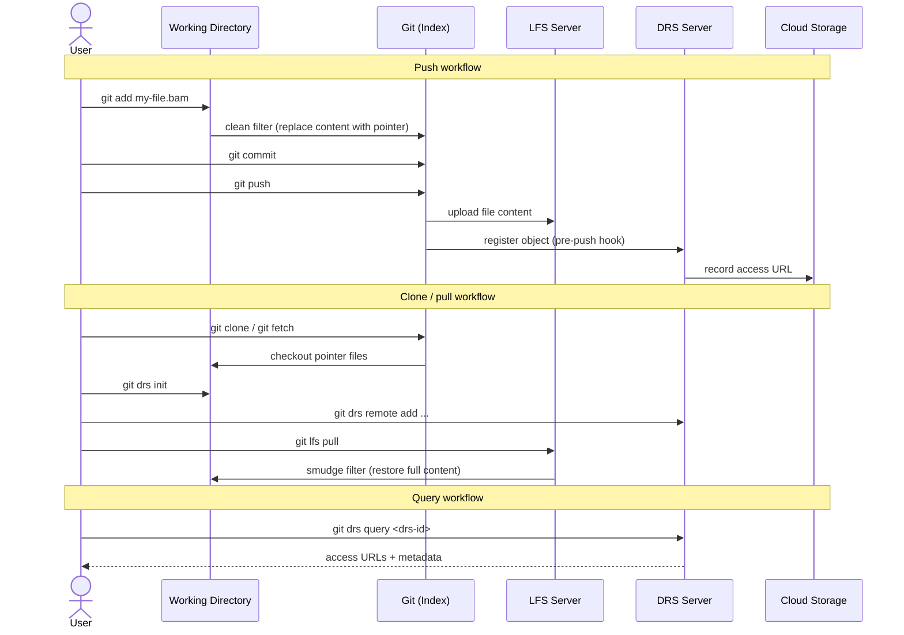

# Git DRS — How It Works

This document describes the internal architecture, pointer file format, and supported cloud backends for Git DRS. For the user-facing command reference and getting started guide, see the [Git DRS Quickstart](quickstart.md).

## How It Works

Git DRS leverages the same **clean / smudge filter** mechanism and **custom transfer agent** protocol used by [Git LFS](https://git-lfs.com/). If you're familiar with [how Git LFS works under the hood](https://github.com/git-lfs/git-lfs/blob/main/docs/spec.md), the following diagram shows where Git DRS fits in:



**The workflow step by step:**

1. **`git lfs track "*.bam"`** — Registers file patterns in `.gitattributes`. See [Git LFS track](https://github.com/git-lfs/git-lfs/blob/main/docs/man/git-lfs-track.adoc).
2. **`git add` / `git commit`** — Standard Git operations. The clean filter replaces file content with a small pointer file.
3. **`git push`** — Git LFS uploads objects to the LFS server. Git DRS hooks automatically register each object with the configured DRS server, making it discoverable by DRS ID.
4. **`git clone` / `git lfs pull`** — Git LFS downloads objects on demand. The smudge filter restores pointer files to their full content. See [Git LFS pull](https://github.com/git-lfs/git-lfs/blob/main/docs/man/git-lfs-pull.adoc).
5. **`git drs query <drs-id>`** — Look up any registered object by its DRS ID to retrieve access URLs and metadata.

### Hooks Integration Table

| Hook/Integration | Command | Purpose |
|------------------|---------|---------|
| **Pre-commit Hook** | `git drs precommit` | Triggered automatically before each commit<br>Processes all staged LFS files<br>Creates DRS records for new files<br>Only processes files that don't already exist on the DRS server<br>Prepares metadata for later upload during push |
| **Custom Transfer (upload)** | `git drs transfer` | Handles upload operations during `git push`<br>Creates indexd record on DRS server<br>Uploads file to Gen3-registered S3 bucket<br>Updates DRS object with access URLs |
| **Custom Transfer (download)** | `git drs transfer` | Handles download operations during `git lfs pull`<br>Retrieves file metadata from DRS server<br>Downloads file from configured storage<br>Validates checksums |


### Protocol Communication

Git LFS and Git DRS communicate via JSON messages. Git LFS uses custom transfers to communicate with Git DRS, passing information through JSON protocol:

```json
{
  "event": "init",
  "operation": "upload",
  "remote": "origin",
  "concurrent": 3,
  "concurrenttransfers": 3
}
```

Response handling and logging occurs in transfer clients to avoid interfering with Git LFS stdout expectations.

For more details, see the [Git LFS Custom Transfer Protocol](https://github.com/git-lfs/git-lfs/blob/main/docs/custom-transfers.md) documentation.

## Complete Command Reference

### `git drs init`

Initialize Git DRS in a repository. Sets up Git LFS custom transfer hooks and configures `.gitignore` patterns.

**Usage:**

```bash
git drs init [flags]
```

**Options:**

| Option | Description | Default |
|--------|-------------|---------|
| `--transfers <n>` | Number of concurrent transfers | 4 |

**Example:**

```bash
git drs init
```

**What it Configures:**

| Component | Purpose |
|-----------|---------|
| Local configuration | Initializes repository-specific DRS settings |
| Git LFS custom transfer agent | Routes LFS transfers through Git DRS — see [Git LFS custom transfer agents](https://github.com/git-lfs/git-lfs/blob/main/docs/custom-transfers.md) |
| `.gitignore` patterns | Excludes DRS cache files from version control |
| Pre-push hooks | Registers LFS objects with the DRS server during `git push` |
| Clean / smudge filters | Processes pointer files on `git add` and `git checkout` — similar to [Git LFS clean](https://github.com/git-lfs/git-lfs/blob/main/docs/man/git-lfs-clean.adoc) and [Git LFS smudge](https://github.com/git-lfs/git-lfs/blob/main/docs/man/git-lfs-smudge.adoc) |

!!! note
    Run this once per repository, after `git lfs install`.

### `git drs remote add gen3 <name>`

Add a Gen3 DRS server configuration.

**Usage:**

```bash
git drs remote add gen3 <remote-name> \
    --url <server-url> \
    --cred <credentials-file> \
    --project <project-id> \
    --bucket <bucket-name>
```

**Options:**

| Parameter | Description | Required |
|-----------|-------------|----------|
| `<remote-name>` | Identifier for this DRS remote (e.g., `production`, `staging`) | Yes |
| `--url <url>` | Gen3 server endpoint | Yes |
| `--cred <file>` | Path to credentials JSON file | Yes* |
| `--token <token>` | Token for temporary access (alternative to --cred) | Yes* |
| `--project <id>` | Project ID in format `<program>-<project>` | Yes |
| `--bucket <name>` | S3 bucket name | Yes |

*Either `--cred` or `--token` is required

**Examples:**

```bash
# Add production remote
git drs remote add gen3 production \
    --url https://calypr-public.ohsu.edu \
    --cred /path/to/credentials.json \
    --project my-project \
    --bucket my-bucket

# Add staging remote
git drs remote add gen3 staging \
    --url https://staging.calypr.ohsu.edu \
    --cred /path/to/staging-credentials.json \
    --project staging-project \
    --bucket staging-bucket
```

!!! note
    The first remote you add automatically becomes the default remote.


### `git drs remote list`

List all configured DRS remotes.

**Usage:**

```bash
git drs remote list
```

**Example Output:**

```
* production  gen3    https://calypr-public.ohsu.edu
  staging     gen3    https://staging.calypr.ohsu.edu
  development gen3    https://dev.calypr.ohsu.edu
```

The `*` indicates the default remote used by all commands unless specified otherwise.

### `git drs remote set <name>`

Set the default DRS remote for all operations.

**Usage:**

```bash
git drs remote set <remote-name>
```

**Examples:**

```bash
# Switch to staging for testing
git drs remote set staging

# Switch back to production
git drs remote set production

# Verify change
git drs remote list
```

### `git drs remote remove <name>`

Remove a configured DRS remote.

**Usage:**

```bash
git drs remote remove <remote-name>
```

**Example:**

```bash
git drs remote remove staging
```

### `git drs fetch [remote-name]`

Fetch DRS object metadata from remote server. Downloads metadata only, not actual files.

**Usage:**

```bash
# Fetch from default remote
git drs fetch

# Fetch from specific remote
git drs fetch staging
git drs fetch production
```

**What it Does:**

- Identifies remote and project from configuration
- Synchronizes all DRS records for a given project from the server to the local repository

!!! note
    `fetch` and `push` are commonly used together for cross-remote workflows. See `git drs push` below.

### `git drs push [remote-name]`

Push local DRS objects to server. Uploads new files and registers metadata.

**Usage:**

```bash
# Push to default remote
git drs push

# Push to specific remote
git drs push staging
git drs push production
```

**What it Does:**

- Checks local repository for DRS metadata
- For each object, uploads file to bucket if file exists locally
- If file doesn't exist locally (metadata only), registers metadata without upload
- This enables cross-remote promotion workflows

**Cross-Remote Promotion Example:**

Transfer DRS records from one remote to another (e.g., staging to production) without re-uploading files:

```bash
# Fetch metadata from staging
git drs fetch staging

# Push metadata to production (no file upload since files don't exist locally)
git drs push production
```

This is useful when files are already in the production bucket with matching SHA256 hashes. It can also be used to re-upload files given that the files are pulled to the repo first.

### `git drs query <drs-id>`

Query a DRS server by DRS ID to retrieve object metadata.

**Usage:**

```bash
git drs query <drs-id>
```

**Example:**

```bash
git drs query drs://example.org/abc123def456
```

Returns metadata about a DRS object, including its access URLs and checksums.

### `git drs create-cache`

Create a cache from a manifest file (Terra/AnVIL).

**Usage:**

```bash
git drs create-cache manifest.tsv
```

### `git drs version`

Display Git DRS version information.

**Usage:**

```bash
git drs version
```

### Internal Commands

These commands are called automatically by Git hooks and should not be invoked directly:

- `git drs precommit` — Process staged files during commit
- `git drs transfer` — Handle file transfers during push/pull
- `git drs transferref` — Handle reference transfers (AnVIL/Terra)

## Environment Variables

Git DRS respects these environment variables:

### AWS Configuration

| Variable | Description |
|----------|-------------|
| `AWS_ACCESS_KEY_ID` | AWS access key for S3 operations |
| `AWS_SECRET_ACCESS_KEY` | AWS secret key for S3 operations |
| `AWS_REGION` | AWS region for S3 operations |
| `AWS_ENDPOINT_URL` | Custom S3 endpoint URL |


## Configuration System

Git DRS stores configuration in Git's local config (`.git/config`).

**Example Configuration (YAML representation):**

```yaml
current_server: gen3
servers:
  gen3:
    endpoint: "https://data.example.org/"
    profile: "myprofile"
    project: "project-123"
    bucket: "data-bucket"
```


### Unit Tests

```bash
# Run all tests
go test ./...

# Test specific functionality
go test ./utils -run TestLFSTrack

# Run tests with verbose output
go test -v ./...
```

### Integration Tests

**Status**: Work in Progress (WIP)

Integration tests are being developed to test end-to-end workflows with real DRS servers.

## Further Reading

- [Git DRS Quick Start](quickstart.md) -- User guide for getting started
- [Troubleshooting](troubleshooting.md) -- Common issues and solutions
- [Git LFS Custom Transfer Agents](https://github.com/git-lfs/git-lfs/blob/main/docs/custom-transfers.md) -- Understanding the transfer protocol
- [Git LFS Specification](https://github.com/git-lfs/git-lfs/blob/main/docs/spec.md) -- Pointer file format details
- [Git Hooks Documentation](https://git-scm.com/book/en/v2/Customizing-Git-Git-Hooks) -- Understanding Git hooks
